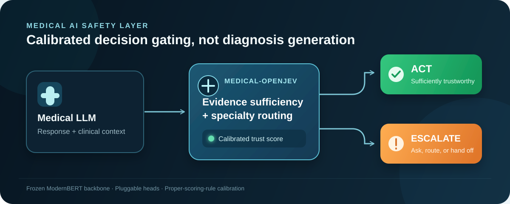

<h1 align="center">
  medical-openjev
  
  
  
</h1>

<p align="center">
  <strong>An open-source, locally deployable, rigorously calibrated medical jev model.</strong>
</p>

<p align="center">
  <a href="https://arxiv.org">📄 arXiv</a>&nbsp;·&nbsp;
  <a href="https://huggingface.co/Qwen/Qwen3.5-4B">🤗 Hugging Face</a>
</p>

<p align="center">
  
</p>

> **medical-openjev** is an open-source, locally deployable, rigorously calibrated medical decision-gating model, positioned against closed-source safety guardrails such as TypeSafe Jev. It does not generate diagnostic answers. Instead, it assesses whether a current answer can be trusted and whether to **act**, escalate to a deeper consultation, or transfer the case for human review.

## Overview

Ordinary LLM self-assessment can be severely overconfident. In our evaluation, an LLM reported a confidence of **0.74** despite an actual accuracy of only **0.28**.

medical-openjev can be attached to any medical LLM. It provides a calibrated confidence score and an actionable decision: **`act`** or **`escalate`**.

```text
Current medical LLM answer
             │
             ▼
      medical-openjev
      ┌──────┴──────┐
      ▼             ▼
     ACT        ESCALATE
             Request missing evidence,
             route to a specialty, or
             transfer for human review
```

## Technical design

The model uses a **frozen ModernBERT backbone** with two lightweight, pluggable heads:

- **Evidence-sufficiency head** — assesses whether the available evidence is sufficient for the current answer.
- **Specialty-routing head** — performs specialty routing.

Training uses reinforcement learning with a strict proper scoring rule, directly optimizing calibration. The model supports millisecond-scale inference on a single GPU. Model weights and evaluation materials are openly available for audit.

## Capabilities

| Capability | What it provides |
| --- | --- |
| **Calibrated confidence scoring** | A calibrated confidence score and an actionable `act` / `escalate` decision for the output of any medical LLM. |
| **Intelligent triage** | Specialty routing for intelligent triage. |
| **Evidence-gap prompts** | Real-time prompts that identify gaps in the evidence collected during a consultation. |
| **High-risk output interception** | Detection and interception of high-risk outputs that are wrong yet highly confident. |
| **Open auditability** | Open model weights and evaluation materials available for audit. |

## Experimental snapshot

Current experiments are based on **Qwen3.5-4B**, compared with the Base LLM and a random baseline.

| Metric | medical-openjev | Base LLM | Random | Outcome |
| --- | ---: | ---: | ---: | --- |
| ECE ↓ | **0.226** | 0.533 | 0.331 | **58% lower** than the Base LLM |
| Brier score ↓ | **0.241** | 0.523 | 0.345 | Approximately halved relative to the Base LLM |
| AURC ↓ | **0.597** | 0.666 | 0.746 | Best among the three methods |
| CovAcc@95% ↑ | **0.281** | 0.246 | 0.263 | Best overall |
| Cov@95prec ↑ | **0.067** | 0.000 | 0.000 | Achieved only by medical-openjev |
| Accuracy of top-confidence 10% ↑ | **0.667** | 0.333 | 0.167 | **2×** the Base LLM |

<p align="center">
  <sub>↓ lower is better &nbsp;·&nbsp; ↑ higher is better</sub>
</p>

On the  evaluation, ECE decreases by about 58%, accuracy in the top-confidence 10% doubles relative to the Base LLM, and confidence is monotonically associated with correctness.

## Intended use

medical-openjev can be attached to medical LLMs as a decision-gating layer to:

- provide calibrated confidence scores and `act` / `escalate` decisions;
- route cases for intelligent triage;
- identify evidence gaps during a consultation; and
- intercept high-risk outputs that are wrong yet highly confident.

## Safety notice

> **Research use only.** medical-openjev is not a clinical device.

## Team and affiliations

| Person | Role | Affiliation |
| --- | --- | --- |
| Tian Gan | Supervision & Project Lead | Shandong University |
| Ruifan Zuo | Student Project Leadership | Shandong University |
| Guocheng Hu | Student Project Leadership | Shandong University |
| Ziyang Meng | Team Member | City University of Hong Kong (Dongguan) |
| Dai Zichao | — | Shandong University |
| Zhao Qichao | — | Tsinghua University |
| Rui Wang | Medical Support | Qingdao Endocrine and Diabetes Hospital |
| San Zhang | Medical Support | Not specified |


## Citation

If you use medical-openjev in your research, please cite the forthcoming paper. Citation details will be added once the preprint is available.

```bibtex
@article{medical_openjev_2026,
  title   = {medical-openjev: Calibrated Decision Gating for Medical AI Agents},
  author  = {{medical-openjev Team}},
  year    = {2026},
  note    = {Manuscript in preparation}
}
```

---

<p align="center">
  ⭐ If medical-openjev helps your research or projects, please give us a star! ⭐
  Made with by the Ilearn  Research Team
</p>
